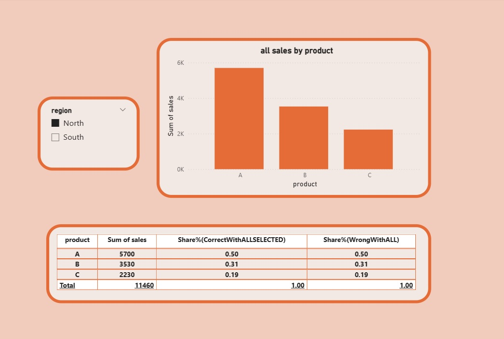

This repository demonstrates one of the most common DAX mistakes in Power BI:
misunderstanding filter context when using ALL() and ALLSELECTED().
The example shows why these two functions may appear identical at first,
and when they actually produce very different analytical results

What this example covers

   •	Why ALL and ALLSELECTED sometimes return the same values

   •	How visual interactions change filter context

   •	The impact on percentages, shares, and totals

   •	A practical scenario suitable for real dashboards

 
 Key Concept
 
   •	ALL → removes filters and forces a global total
 
   •	ALLSELECTED → respects user selections and controls only visual context

## Dashboard Preview  

